
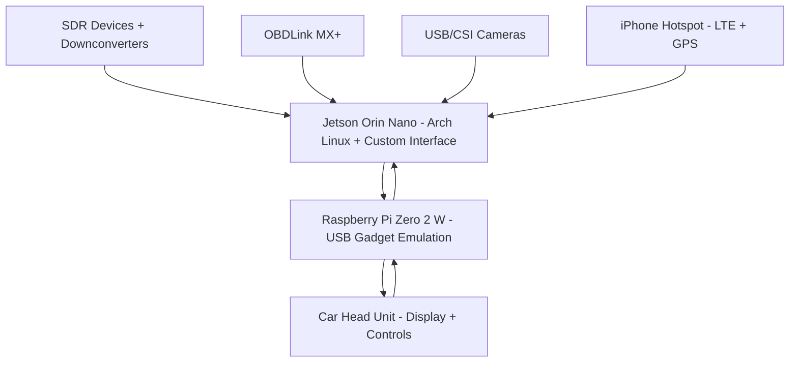

#  [roadarch](./wiki)

> Arch Linux–based in-car platform for the NVIDIA Jetson Orin Nano.  
> Projects a custom Linux interface to the vehicle head unit, integrates SDR radar detection, OBD telemetry, cameras, GPS from hotspot, and optional AI agents for an open, extensible automotive dashboard.

---

## Features
- Custom Arch Linux interface projected to car head unit via USB gadget bridge
- SDR-based radar detection with DSP (X, K, Ka, POP, Laser support planned)
- OBD-II telemetry via OBDLink MX+
- Multi-camera support with Jetson hardware acceleration
- GPS and internet integration using iPhone hotspot
- AI/LLM integration for local reasoning and adaptive dashboard behavior

---

## [Hardware Requirements](./wiki/Hardware-Requirements)
- NVIDIA Jetson Orin Nano 8GB + NVMe SSD  
- Raspberry Pi Zero 2 W (USB gadget bridge)  
- SDRs: USRP B200/B210 or HackRF + RFbeam modules / downconverters  
- OBDLink MX+ for vehicle telemetry  
- USB/CSI cameras  
- iPhone hotspot for GPS + internet  

---

## [Installation](./wiki/Install-Guide)
1. Flash Jetson with NVIDIA Jetson Linux BSP.  
2. Replace root filesystem with Arch Linux ARM.  
3. Clone this repo onto your Jetson.  
4. Follow the [Install Guide](./wiki/Install-Guide).

---

## [Architecture](./wiki/Architecture)

---

## Usage
- Boot Jetson → auto-starts custom Linux interface  
- Connect Pi Zero → car head unit recognizes Android Auto device  
- Run SDR flowgraphs with GNU Radio to detect radar signals  
- Pair OBDLink MX+ for real-time vehicle telemetry  
- GPS feed and internet via iPhone hotspot  

---

## Roadmap
- [x] Baseline Arch install on Jetson  
- [ ] Head unit projection with Pi Zero gadget  
- [ ] K-band radar integration  
- [ ] X/Ka-band downconverter chains  
- [ ] POP radar detection optimization  
- [ ] Optical laser sensing array  
- [ ] Full multi-sensor fusion and AI overlay  

---

## License
MIT License — see [LICENSE](./LICENSE) for details.

---

## Links
- [Wiki](./wiki/Overview) — full documentation  
- [Hardware Requirements](./wiki/Hardware-Requirements)  
- [Install Guide](./wiki/Install-Guide)  
- [Architecture](./wiki/Architecture)
