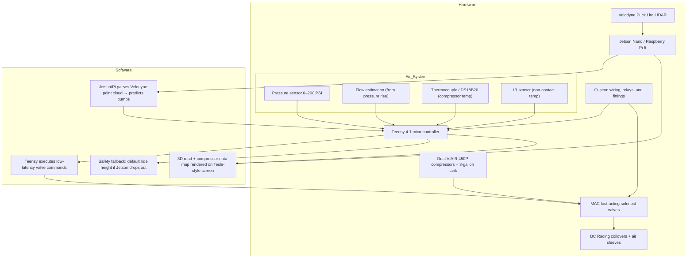

# active-suspension

>An experimental **active air suspension system** that combines **BC Racing coilovers with air sleeves** and **real-time road scanning** to achieve near-seamless ride height adjustment.  
**The goal:** smoother handling, self-leveling, and predictive bump absorption.

---

## How It Works

1. **LIDAR scans** the road ~10–20 ft ahead.  

2. Jetson/Pi **processes the point cloud** with a Kalman filter.  
3. Height commands (`+8mm`, `-4mm`, etc.) are sent to Teensy.  
4. Teensy **fires valves** within microseconds to adjust suspension.  
5. The Tesla-Cinematic Display shows a **real-time 3D road preview & compressor information**.  

---

## Overview



- **Hardware**
  - BC Racing coilovers retrofitted with air sleeves
  - Dual VIAIR 450P compressor + 3-gallon tank
  - MAC fast-acting solenoid valves
  - Teensy 4.1 microcontroller (real-time valve control)
  - NVIDIA Jetson Nano / Raspberry Pi 5 (LIDAR preprocessing + visualization)
  - Velodyne Puck Lite LIDAR (road scanning)
  - Custom wiring, relays, and fittings
  - Tesla-Cinematic Display 16:9.5 aspect ratio & ~2200×1300 resolution (~150 PPI)

- **Software**
  - Jetson/Pi parses Velodyne point cloud → predicts bumps
  - Teensy executes low-latency valve commands
  - 3D road vector map rendered on Tesla-style screen
  - Safety fallback: default ride height if Jetson drops out

---

## File Structure

```
active-suspension/
├── jetson/         # LIDAR drivers, point-cloud filtering, control logic
├── teensy/         # Real-time valve actuation firmware
├── common/         # Shared protocol definitions (UART/CAN schemas)
└── docs/           # Schematics, wiring diagrams, notes
```

---

>[!CAUTION]
>This is a **research/DIY project**. It is **not certified for road use** and comes with **no warranties**.  
Use at your own risk. Incorrect installation or software faults could result in suspension failure.

>Without a high-capacity alternator (150A+) or a secondary battery, you risk voltage drops or battery drain.

---

>[!NOTE]
>Tesla, Chevrolet®, Malibu®, and the bowtie emblem are trademarks of General Motors.  
This project is **not affiliated with, endorsed by, or representative of GM**.  
